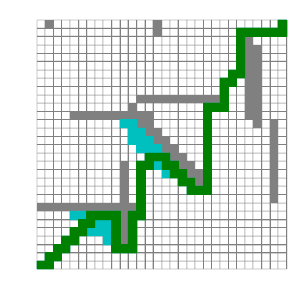

# search_algorithm
Different search algoruthm to find path in a maze

目前只有A*

`random_map.py`包含了节点类和地图类；

`search_algorithm.py`包含了`AStar`类，即A*算法；

`main.py`为入口文件。

使用方法：运行`main.py`即可。

目前，使用的是matplotlib的交互模式，实现动态刷新功能。

最终保存路径图片到img文件夹。

蓝色+绿色为经过的点，绿色为回溯时寻找的路径。

TODO：

- [ ] BFS、DFS
- [ ] Dijkstra
- [ ] GBFS

