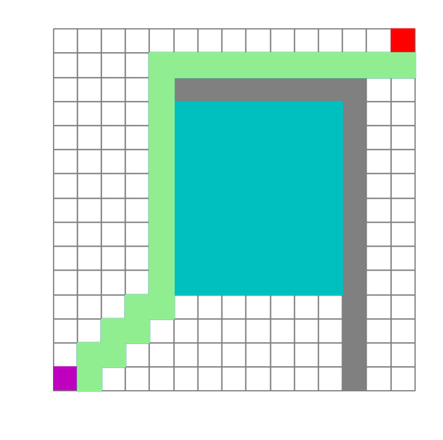

# search_algorithm
### Different search algoruthm to find path in a maze

目前有A*算法和BFS

#### 文件

`random_map.py`包含了节点类和地图类；

`search_algorithm.py`包含了`AStar`类，即A*算法；

`main.py`为入口文件。

#### 使用

使用方法：运行`main.py`即可。

使用matplotlib的交互模式，实现搜索节点时的map动态刷新功能。

最终保存路径图片到img文件夹。

#### 样例

##### A*

蓝色+绿色为经过的点，绿色为回溯时寻找的路径。

##### BFS

TODO：

- [x] BFS
- [ ] DFS
- [ ] Dijkstra
- [ ] GBFS

